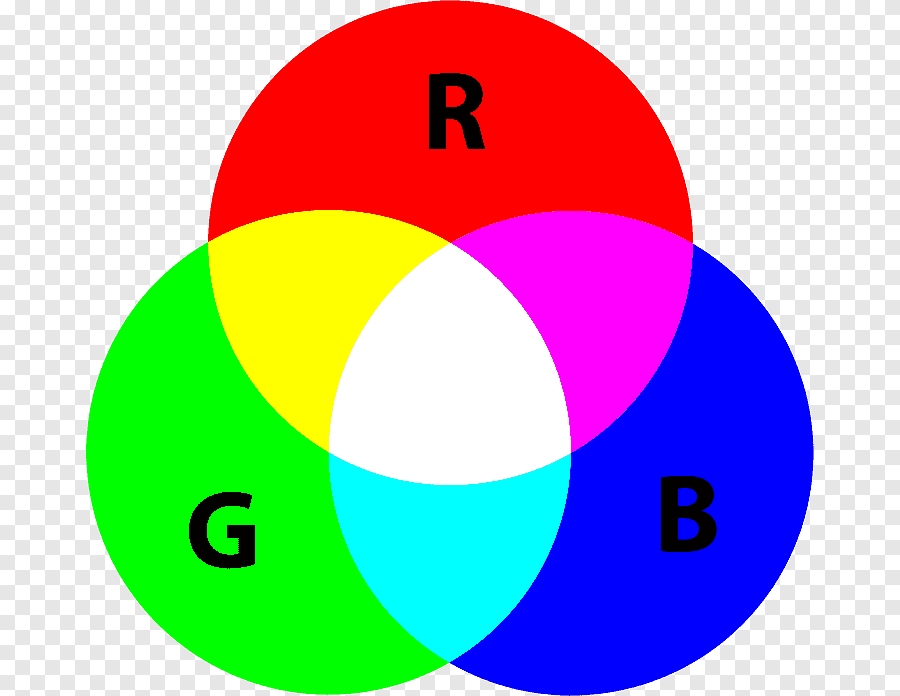
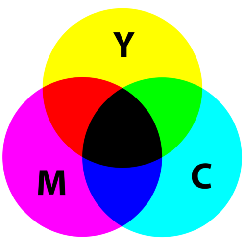
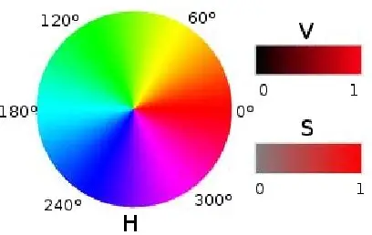
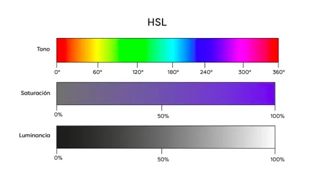
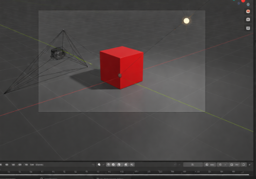
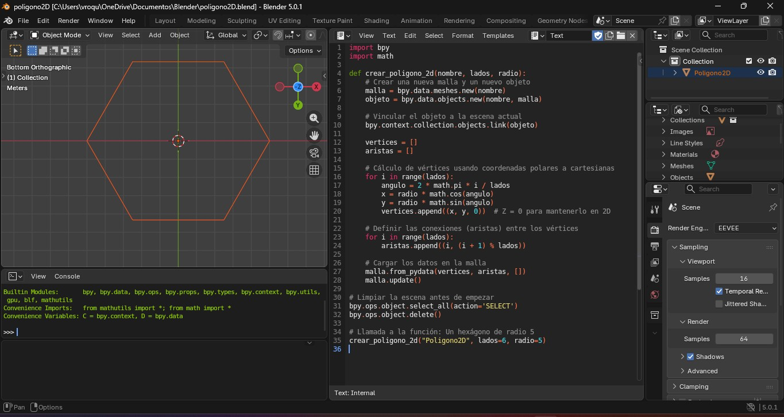

# 📘 Unidad I – Introducción a la Graficación por Computadora

---
## 📑 Índice

- [Introducción](#introducción)
- [1.1 Historia y evolución de la graficación por computadora](#11-historia-y-evolución-de-la-graficación-por-computadora)
- [1.2 Áreas de aplicación de la graficación por computadora](#12-áreas-de-aplicación-de-la-graficación-por-computadora)
- [1.3 Aspectos matemáticos de la graficación](#13-aspectos-matemáticos-de-la-graficación)
- [1.4 Modelos de color](#14-modelos-de-color)
   - [RGB (Red, Green, Blue)](#rgb-red-green-blue)
   - [CMY (Cyan, Magenta, Yellow)](#cmy-cyan-magenta-yellow)
   - [HSV (Hue, Saturation, Value)](#hsv-hue-saturation-value)
   - [HSL (Hue, Saturation, Lightness)](#hsl-hue-saturation-lightness)
- [Tutorial: Iluminación básica de un cubo en Blender](#tutorial-iluminación-básica-de-un-cubo-en-blender)
- [1.5 Representación y trazo de líneas y polígonos](#15-representación-y-trazo-de-líneas-y-polígonos)
- [1.5.1 Formatos de imagen](#151-formatos-de-imagen)
- [Práctica: Polígono y Flor de la Vida](#práctica-polígono-y-flor-de-la-vida)
- [1.6 Procesamiento de mapas de bits](#16-procesamiento-de-mapas-de-bits)
- [Conclusión](#conclusión)
- [📚 Bibliografía (Formato APA)](#-bibliografía-formato-apa)

---
# Introducción

La graficación por computadora es una disciplina fundamental dentro de la informática que se encarga de la generación, manipulación y representación de imágenes mediante el uso de algoritmos y hardware especializado. Esta área combina conocimientos de matemáticas, física, programación y diseño visual para crear imágenes digitales en dos y tres dimensiones.

Actualmente, la graficación por computadora es indispensable en múltiples sectores como el entretenimiento, la ingeniería, la medicina, la arquitectura y la simulación científica. Gracias a los avances en el procesamiento gráfico (GPU), hoy es posible generar imágenes realistas en tiempo real.

---

# 1.1 Historia y evolución de la graficación por computadora

---

## 📌 Etapa inicial (1950 – 1960): Origen científico y militar

En la década de 1950, las primeras computadoras utilizaban pantallas de tubo de rayos catódicos (CRT) para mostrar información básica. Los gráficos eran simples líneas vectoriales generadas mediante cálculos matemáticos.

Aplicaciones principales:
- Sistemas de radar
- Simuladores de vuelo
- Investigación científica

En 1963, Ivan Sutherland desarrolló **Sketchpad**, considerado el primer sistema de gráficos interactivos. Este programa permitió:
- Dibujar figuras directamente en pantalla
- Manipular objetos con un lápiz óptico
- Aplicar restricciones geométricas
- Crear estructuras jerárquicas

Sketchpad introdujo conceptos fundamentales como:
- Modelado de objetos
- Interacción hombre-máquina
- Representación estructurada de datos gráficos

Este evento marcó el nacimiento formal de la graficación por computadora como disciplina académica.

---

## 📌 Etapa de desarrollo algorítmico (1970 – 1980)

En esta etapa se desarrollaron los fundamentos matemáticos y algorítmicos que aún se utilizan actualmente.

Se introdujeron los gráficos rasterizados, donde la imagen se representa como una matriz de píxeles. Esto permitió representar imágenes más complejas y detalladas.

Se desarrollaron algoritmos esenciales como:

- Algoritmo de Bresenham (trazado eficiente de líneas)
- Algoritmo DDA
- Algoritmos de relleno de polígonos
- Eliminación de superficies ocultas
- Algoritmo Z-buffer

También comenzaron los estudios sobre iluminación y sombreado, dando origen a modelos como:
- Sombreado de Gouraud
- Sombreado de Phong

Durante esta década surgieron los primeros videojuegos comerciales con gráficos digitales.

---

## 📌 Etapa de expansión tridimensional (1980 – 1990)

En los años 80 la graficación 3D comenzó a consolidarse. Se desarrollaron técnicas como:

- Modelado de sólidos
- Mapeo de texturas
- Transformaciones en tres dimensiones
- Proyecciones en perspectiva

La industria del cine empezó a incorporar gráficos generados por computadora (CGI). Esto impulsó el desarrollo de técnicas más realistas de iluminación y renderizado.

Se comenzaron a usar estaciones de trabajo especializadas para procesamiento gráfico.

---

## 📌 Etapa de aceleración por hardware (1990 – 2005)

Durante los años 90 se produjo una revolución tecnológica con la aparición de las primeras tarjetas gráficas (GPU).

Las GPU permitieron:
- Procesamiento paralelo
- Renderizado en tiempo real
- Mayor velocidad en cálculos matriciales

Se establecieron estándares gráficos como:
- OpenGL
- DirectX

Los videojuegos evolucionaron hacia entornos tridimensionales completos con motores gráficos avanzados.

---

## 📌 Etapa moderna (2005 – Actualidad)

La graficación por computadora actual integra:

- Renderizado fotorrealista
- Trazado de rayos (Ray Tracing)
- Simulación física avanzada
- Inteligencia artificial
- Realidad virtual (VR)
- Realidad aumentada (AR)

Las GPU modernas contienen miles de núcleos capaces de realizar millones de operaciones por segundo.

Además, la inteligencia artificial ha permitido avances como:
- Generación automática de imágenes
- Mejora de resolución (super-resolution)
- Simulación de materiales realistas

---

## 📌 Importancia histórica

La evolución de la graficación por computadora no solo ha transformado el entretenimiento, sino también:

- La ingeniería y el diseño industrial
- La medicina diagnóstica
- La visualización científica
- La educación interactiva

Actualmente, la graficación por computadora es una herramienta esencial en la sociedad digital, permitiendo representar y analizar información compleja de manera visual y comprensible.

# 1.2 Áreas de aplicación de la graficación por computadora

A continuación, se describen sus principales áreas de aplicación con mayor profundidad:

---

## 🎮 1. Industria de los videojuegos

La industria de los videojuegos es una de las áreas donde la graficación por computadora ha tenido mayor desarrollo tecnológico.

Se emplean técnicas como:

- Modelado tridimensional (3D)
- Renderizado en tiempo real
- Simulación física (colisiones, gravedad, partículas)
- Iluminación dinámica
- Animación esquelética
- Texturizado y sombreado avanzado

Los motores gráficos permiten generar millones de polígonos por segundo, creando entornos interactivos complejos. Además, se utilizan técnicas como:

- Ray Tracing en tiempo real
- Oclusión ambiental
- Mapeo normal (Normal Mapping)
- Sombras dinámicas

La optimización es clave, ya que los gráficos deben procesarse a altas tasas de cuadros por segundo (FPS).

---

## 🎬 2. Cine y animación digital

En la industria cinematográfica, la graficación por computadora permite crear:

- Personajes digitales hiperrealistas
- Escenarios virtuales
- Simulación de fluidos (agua, fuego, humo)
- Efectos especiales (VFX)
- Animación por captura de movimiento (Motion Capture)

A diferencia de los videojuegos, el renderizado en cine no es necesariamente en tiempo real. Cada cuadro puede tardar minutos u horas en procesarse para alcanzar un nivel fotorrealista.

Se utilizan técnicas como:

- Renderizado por trazado de rayos (Ray Tracing)
- Global Illumination
- Simulación de partículas
- Subsurface Scattering (dispersión de luz en materiales como piel)

---

## 🏗 3. Arquitectura e ingeniería (CAD)

En arquitectura e ingeniería se emplean sistemas CAD (Computer-Aided Design) para:

- Diseñar planos estructurales
- Modelar edificaciones en 3D
- Simular iluminación natural
- Analizar estructuras
- Realizar recorridos virtuales

La visualización previa de un proyecto permite detectar errores antes de la construcción física, reduciendo costos y riesgos.

También se utilizan modelos BIM (Building Information Modeling), que integran información estructural y visual en un solo entorno digital.

---

## 🧬 4. Visualización científica

La visualización científica convierte grandes cantidades de datos numéricos en representaciones visuales comprensibles.

Aplicaciones:

- Simulaciones climáticas
- Modelos moleculares
- Astronomía
- Análisis estadístico
- Física computacional

Se utilizan gráficos 2D y 3D para representar:

- Superficies
- Isosuperficies
- Mapas de calor
- Diagramas tridimensionales

La graficación permite interpretar patrones complejos que serían difíciles de analizar únicamente con datos numéricos.

---

## 🏥 5. Medicina

En el área médica, la graficación por computadora permite:

- Reconstrucción tridimensional de órganos
- Visualización de tomografías (CT)
- Resonancias magnéticas (MRI)
- Simulación quirúrgica
- Planificación de tratamientos

Mediante algoritmos de reconstrucción volumétrica, es posible generar modelos 3D a partir de imágenes médicas bidimensionales.

Esto mejora la precisión en diagnósticos y procedimientos quirúrgicos.

---

## ✈ 6. Simulación y entrenamiento

Se utiliza en:

- Simuladores de vuelo
- Simuladores de conducción
- Entrenamiento militar
- Simulaciones industriales

Estos sistemas requieren:

- Renderizado en tiempo real
- Modelos físicos precisos
- Interacción con dispositivos externos

La simulación reduce riesgos y costos al permitir entrenamientos en entornos virtuales controlados.

---

## 📱 7. Interfaces gráficas de usuario (GUI)

La mayoría de los sistemas operativos modernos utilizan interfaces gráficas que dependen directamente de la graficación por computadora.

Elementos gráficos incluyen:

- Ventanas
- Botones
- Menús
- Íconos
- Animaciones

Las GUI mejoran la interacción humano-computadora mediante representaciones visuales intuitivas.

---

## 🧠 8. Inteligencia artificial y gráficos

Actualmente la inteligencia artificial se integra con la graficación por computadora para:

- Generación automática de imágenes
- Mejora de resolución (super-resolution)
- Reconstrucción facial
- Modelado procedural
- Renderizado asistido por IA

Esta integración representa una de las áreas más innovadoras y de rápido crecimiento.

---

## 📌 Importancia general

La graficación por computadora no solo tiene aplicaciones estéticas, sino también científicas, técnicas y educativas. Permite:

- Mejor comprensión de información compleja
- Simulación segura de escenarios peligrosos
- Visualización previa de proyectos
- Creación de entornos interactivos avanzados

Su impacto en la sociedad moderna es fundamental, ya que prácticamente cualquier dispositivo digital utiliza algún tipo de procesamiento gráfico.

# 1.3 Aspectos matemáticos de la graficación

La base matemática es fundamental en la graficación por computadora.

## Álgebra Lineal

Se utilizan vectores y matrices para representar puntos y transformaciones en el espacio.

Un punto en 2D se representa como:
P = (x, y)

En 3D:
P = (x, y, z)

Las matrices permiten realizar transformaciones como:

- Traslación
- Rotación
- Escalamiento

Fórmula general:

P' = M · P

Donde:
P = punto original  
M = matriz de transformación  
P' = punto transformado  

---

## Geometría Analítica

Permite representar:

Recta:
y = mx + b

Circunferencia:
(x - h)² + (y - k)² = r²

Plano en 3D:
Ax + By + Cz + D = 0

---

## Transformaciones Geométricas

### Traslación
Mueve un objeto de posición.

### Rotación
Gira un objeto respecto a un eje.

### Escalamiento
Cambia el tamaño del objeto.

### Reflexión
Refleja un objeto respecto a un eje.

---

# 1.4 Modelos de color

El color en gráficos digitales se representa mediante modelos matemáticos.

## RGB (Red, Green, Blue)

Modelo aditivo utilizado en pantallas.  
Cada color se representa con valores entre 0 y 255.

Ejemplo:
Blanco = (255, 255, 255)  
Negro = (0, 0, 0)

### Representación gráfica del modelo RGB

---

## CMY (Cyan, Magenta, Yellow)

Modelo sustractivo utilizado en impresión.  
Funciona restando luz reflejada.

Relación:
CMY = 1 - RGB

### Representación gráfica del modelo CMY

---

## HSV (Hue, Saturation, Value)

Hue: tono (0° a 360°)  
Saturation: intensidad  
Value: brillo  

Permite manipular colores de forma más intuitiva.

### Representación gráfica del modelo HSV

---

## HSL (Hue, Saturation, Lightness)

Similar a HSV pero controla la luminosidad de forma diferente.  
Es útil para diseño gráfico y edición de imágenes.

### Representación gráfica del modelo HSL

---

## Tutorial: Iluminación básica de un cubo en Blender

1. Abrir Blender.
2. Insertar cubo (Shift + A → Mesh → Cube).
3. Agregar luz tipo Point.
4. Ajustar intensidad.
5. Crear material nuevo.
6. Modificar color base.
7. Activar modo Rendered.
8. Renderizar con F12.

Conceptos utilizados:
- Iluminación
- Materiales
- Sombreado
- Renderizado
- 
### Representación gráfica del cubo en Blender

---

# 1.5 Representación y trazo de líneas y polígonos

## Representación de líneas

Ecuación general:

y = mx + b

En gráficos digitales se utilizan algoritmos como:
- Algoritmo de DDA
- Algoritmo de Bresenham

Estos permiten dibujar líneas utilizando píxeles discretos.

---

## Representación de polígonos

Un polígono se define mediante:
- Lista de vértices
- Lista de aristas

Ejemplo de cuadrado:

(0,0)  
(2,0)  
(2,2)  
(0,2)

Los polígonos son la base del modelado 3D.

---

# 1.5.1 Formatos de imagen

## Formatos Raster

Basados en píxeles.

- JPG
- PNG
- BMP
- GIF

Características:
- Dependen de la resolución.
- Pueden perder calidad al ampliarse.

---

## Formatos Vectoriales

Basados en ecuaciones matemáticas.

- SVG
- EPS
- PDF

Características:
- No pierden calidad.
- Ideales para diseño gráfico.

---

## Práctica: Polígono y Flor de la Vida

### Ejercicio 1
Dibujar un hexágono regular usando coordenadas cartesianas.

## Resultado en Blender

### Ejercicio 2
Flor de la vida:
- Dibujar un círculo.
- Repetir círculos con mismo radio.
- Crear patrón geométrico simétrico.

Este ejercicio ayuda a comprender:
- Simetría
- Coordenadas
- Geometría aplicada

## Resultado en Blender

---

# 1.6 Procesamiento de mapas de bits

Un mapa de bits es una matriz de píxeles.

Ejemplo:
Imagen 800 × 600

Total:
800 × 600 = 480,000 píxeles

Cada píxel puede almacenar:
- 8 bits por canal RGB
- Total = 24 bits por píxel

---

## Procesos comunes en mapas de bits

- Escalado
- Rotación
- Filtros (desenfoque, nitidez)
- Ajuste de brillo y contraste
- Detección de bordes
- Compresión (JPEG, PNG)

El procesamiento digital de imágenes es una extensión directa de la graficación por computadora.

---

# Conclusión

La graficación por computadora es una disciplina que combina matemáticas, programación y diseño para generar imágenes digitales. Su evolución ha permitido avances significativos en múltiples industrias, desde el entretenimiento hasta la medicina. Comprender sus fundamentos matemáticos, modelos de color y representación geométrica es esencial para el desarrollo de aplicaciones gráficas modernas.

---

# 📚 Bibliografía (Formato APA)

Foley, J. D., van Dam, A., Feiner, S. K., & Hughes, J. F. (1996). *Computer Graphics: Principles and Practice*. Addison-Wesley.

Hearn, D., & Baker, M. P. (2014). *Computer Graphics with OpenGL*. Pearson.

Shirley, P. (2012). *Fundamentals of Computer Graphics*. CRC Press.

Blender Foundation. (2023). *Blender Manual*. https://docs.blender.org/
